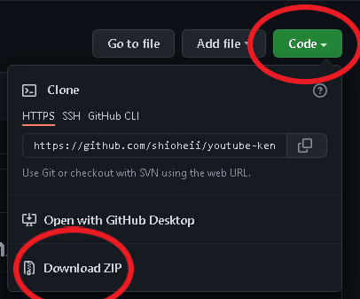

# Projeto Clone do Youtube da Kenzie
<a href="https://github.com/shioheii">
  
</a> 
<a href="https://github.com/shioheii">
  
</a> 
<a href="https://github.com/shioheii">
  
</a>
<a href="https://github.com/shioheii">
  
</a> <br />

Esse projeto foi desenvolvido por mim, enquanto participava do evento online: Maratona de Programação - V Edição, realizado pela [Kenzie Academy](https://kenzie.com.br/).

## Sobre o projeto:
A proposta do projeto era desenvolver o clone da página do canal da Kenzie, no [Youtube](https://www.youtube.com/). por não ter estudado muito as linguagens do front-end, fui fazendo passo a passo, conforme os professores iam avançando no projeto, me atentando aos novos conceitos.

## O que aprendi?
Pude ver na prática a estruturação de uma página na internet, bem como questões de sintaxe e boas práticas no HTML, CSS e JavaScript. Compreendi que o JS é uma excelente ferramenta, e tenho interesse de estudar em breve, questões como trabalhar com o DOM, e quem sabe com o NodeJS, futuramente.

## Linguagens utilizadas:
- HTML
- CSS
- JavaScript

## Ferramenta utilizada:
- [Visual Studio Code](https://code.visualstudio.com/)

## Executar projeto na sua máquina:
Para executar este projeto no seu computador, basta clicar em "Code" e depois em "Download ZIP":


Ou clone o repositório pelo link:
```bash
$ git https://github.com/shioheii/youtube-kenzie-clone.git
```

Então abra a página "index.html" no navegador.

Observação: Por ser um dos meus primeiros contatos com o front-end, o site não foi desenvolvido de forma responsiva, então pode ser que a aparência do site não fique como deveria estar. Resolução de tela ideal: 1920 x 1080.

---

<p align="center">
  <a alt="Bruno Shiohei Kinoshita do Nascimento Linkedin" href="https://www.linkedin.com/in/bruno-shiohei/">
    
  </a>
  <a alt="Bruno Shiohei Kinoshita do Nascimento GitHub" href="https://github.com/shioheii">
    
  </a>
</p>
